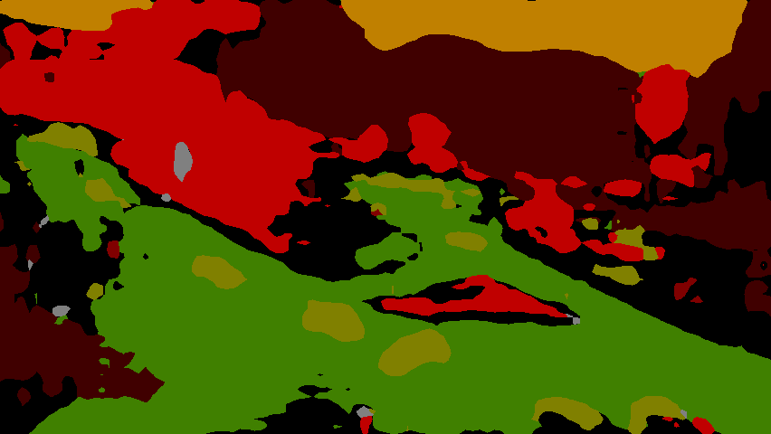

# train-aeroscapes-with-gluon

无人机视角语义分割数据集 aeroscapes 的训练及预测 | train with drone view  dataset aeroscapes and predict 

## 环境 | depends on

- mxnet,gluon-cv

## 训练 | training

1. 准备数据集 | prepare dataset

数据集的谷歌网盘链接在这里：https://github.com/ishann/aeroscapes | Google Drive link of dataset here

解压并将数据集放到文件夹 `./aeroscapes` | unzip and put aeroscapes dataset inside folder `./aeroscapes`

```
train-aeroscapes-with-gluon
    aeroscapes/
        JPEGImages/
            3269 RGB images.
        SegmentationClass/
            3269 ground-truth segmentation masks.
        Visualizations/
            3269 RGB ground-truth segmentation visualizations.
        ImageSets/
            Training and validation splits for data.
```

然后放入数语义分析据集的txt文件 | then prepare Segmentation dataset txt

```
mv Segmentation/ aeroscapes/ImageSets/
```

2. 运行训练 | run training

```
python3 train_fcn.py
```

参数调整参考 `train_fcn.py` | params refer `train_fcn.py`

生成模型参数文件路径： `runs/pascal_aug/fcn/default/checkpoint.params` | output weights here 

pretrained params(google drive): https://drive.google.com/file/d/1__mNQFFjCMonBI9tktN80Erx-e6blCSa/view?usp=sharing

## 检测 | predict

```
cp runs/pascal_aug/fcn/default/checkpoint.params ./
python3 predict.py
```

输入 | input：


输出 | output：

